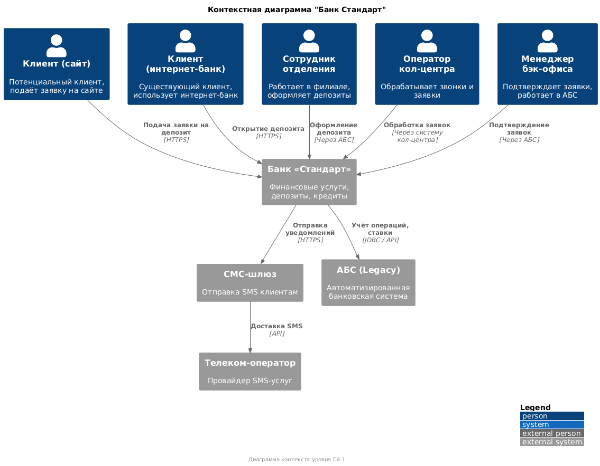
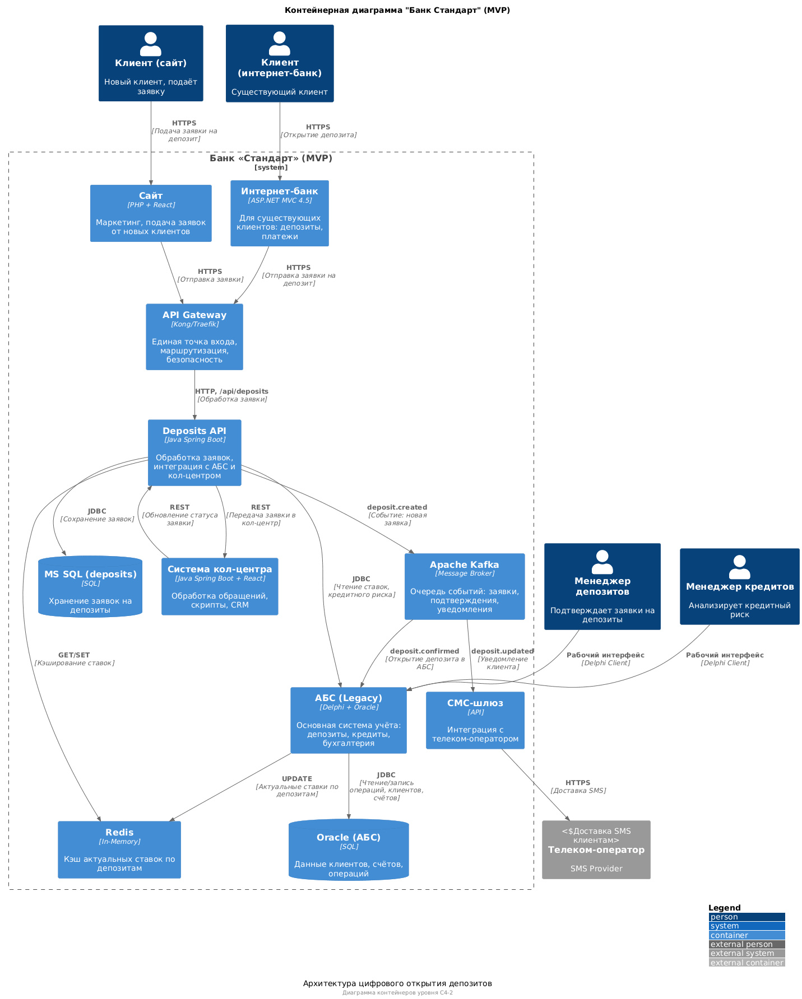

### **Название задачи:** Задание 3
### **Автор:** Хошафян Даниил
### **Дата:** 4 сентября 2025г
### **Функциональные требования**
Опишите здесь верхнеуровневые Use Cases. Их нужно оформить в виде таблицы с пошаговым описанием:
 - Клиент может подать заявку на депозит через сайт или интернет-банк.
 - Сайт отображает актуальные ставки.
 - Интернет-банк отображает персонализированные ставки.
 - Заявка обрабатывается сотрудником бэк-офиса (MVP).
 - Клиент получает СМС при подтверждении ставки и открытии депозита.
 - Система кол-центра уведомляется о заявке с сайта.
 - Данные передаются безопасно (HTTPS, шифрование).

| **№** | **Действующие лица или системы** |**Use Case**| **Описание**                                                           |
|:-----:|:---------------------------------| :- |:-----------------------------------------------------------------------|
|   1   | Клиент (новый)                   |Подача заявки на депозит через сайт| Клиент вводит ФИО и номер телефона, нажимает «Подать заявку».          |
|   2   | Система сайта                    |Валидация и отправка заявки| Проверяет корректность данных, отправляет заявку в систему кол-центра. |
|   3   | Система кол-центра               |Получение и обработка заявки| Менеджер получает заявку, связывается с клиентом, предлагает условия.  |
|   4   | Клиент (существующий)            |      Открытие депозита в интернет-банке      | Выбирает счёт, сумму, подаёт заявку.                                   |
|   5   |Интернет-банк|Отправка заявки в Deposits API| Передаёт заявку с подтверждением по СМС.                               |
|   6   |Deposits API|Приём заявки и сохранение в БД| Сохраняет заявку, уведомляет бэк-офис.                                 |
|   7   |Сотрудник бэк-офиса|Обработка заявки в АБС| Открывает депозит в АБС, подтверждает ставку.                          |
|   8   |АБС|Генерация события об открытии депозита| Отправляет событие в Kafka.                                            |
|   9   |Deposits API                                  | Получение события из Kafka           | Обновляет статус заявки.                                               |
|  10   |Deposits API |Отправка СМС клиенту| Через СМС-шлюз уведомляет клиента об открытии депозита.                |
|  11   |Система кол-центра|Получение события о заявке| Показывает заявку менеджеру.                                           |
|  12   |Сотрудник бэк-офиса                            | Расчёт ставки (через Excel или новую систему)| Определяет ставку на основе рисков.                                                                       |
|  13   | Deposits API                                 | Получение ставки от бэк-офиса           |  Обновляет заявку, отправляет СМС клиенту.                                                                      |

### **Нефункциональные требования**
Опишите здесь нефункциональные требования и архитектурно значимые требования.

| **№** | **Требование**                                                                                                                                                                                                                                           |
|:-----:|:---------------------------------------------------------------------------------------------------------------------------------------------------------------------------------------------------------------------------------------------------------|
|   1   | Система должна быть доступна 24/7 с уровнем 99.9% — обеспечивается через резервный ЦОД и Kubernetes                                                                                                                                                      |
|   2   | Интернет-банк не должен напрямую обращаться к АБС — используется промежуточный слой Deposits API                                                                                                                                                         |
|   3   | Заявки не должны теряться при сбое — используется Kafka для надёжного хранения событий.                                                                                                                                                                  |
|   4   | Персональные данные с сайта должны шифроваться (HTTPS) — реализуется с помощью Ingress-контроллера с TLS.                                                                                                                                                |
|   5   | Отклик на запросы — менее 500 мс — достигается кэшированием ставок в Redis.                                                                                                                                                                              |
|   6   | Горизонтальное масштабирование интернет-банка — реализуется через Kubernetes и stateless-дизайн.                                                                                                                                                         |
|   7   | Поддержка существующих технологий (.NET, Java, MS SQL, Oracle)" — Deposits API" разрабатывается на Java, интеграция через JDBC."                                                                                                                         |
|   8   | Архитектура должна поддерживать переход к микросервисам — используется API Gateway и Kafka.                                                                                                                                                              |
|   9   | Ограничение доступа между депозитами и кредитами — реализуется через RBAC и аудит.                                                                                                                                                                       |
|  10   | Интерфейс должен соответствовать корпоративному стилю — используется единая система дизайна.                                                                                                                                                             |
|  11   | "Использование Kafka разрешено, но интернет-банк не поддерживает его напрямую" — интеграция через адаптер (REST → Kafka).                                                                                                                                |
|  12   | Система должна быть документирована — создание API-документации (OpenAPI) и архитектурных диаграмм.                                                                                                                                                      |
|  13   | Решение должно быть совместимо с подрядчиком — интеграция с кол-центром через REST API.                                                                                                                                                                  |
|  14   | Отказоустойчивость: при сбое в основном ЦОД — автоматический переход на резервный — реализуется через Kubernetes и Ingress.                                                                                                                              |
|  15   | Все транзакции должны логироваться" — используется централизованное логирование"                                                                                                                                                                         |

### **Решение**
Приведите диаграммы контекста и контейнеров в модели C4. Опишите там основные компоненты и 
интеграции всех элементов решения.
\
\

Решения принимались на основе требований FURPS+, анализа IT-ландшафта и стратегии цифровой трансформации. \
Основные принципы:

Минимизация зависимости от подрядчика: использовать внутреннюю экспертизу.\
Безопасность и соответствие регуляторным требованиям: шифрование, аудит, изоляция данных.\
Масштабируемость и отказоустойчивость: 99.9% доступность, фейловер между ЦОД.\
Совместимость с существующими технологиями: .NET, Java, MS SQL, Oracle.\
Поддержка поэтапного перехода к микросервисной архитектуре: Strangler Fig.\
Избежание перегрузки АБС: не прямые вызовы, а асинхронная интеграция.

**Ключевые решения и их обоснование**
1. Введение микросервиса Deposits API\
   Технология: Java Spring Boot\
   Обоснование: Команда АБС имеет экспертизу в Java.Можно вносить изменения без подрядчика.   Совместим с Kafka, 
    Redis, Oracle. Поддерживает REST и асинхронную обработку.\
   FURPS+ требования: F1, F2, F6, S1, S2,R1

2. Использование Kafka для асинхронной интеграции
   Обоснование:\
   Обеспечивает отказоустойчивость (сообщения не теряются при сбое). Позволяет декомпозировать систему. Позволяет избежать прямых вызовов АБС.\
   FURPS+ требования: R3, P3, S4, R2, Rel1\
   Ограничение: Интернет-банк на .NET 4.5 не поддерживает Kafka напрямую.
     Решение: Использовать адаптер (REST → Kafka) в Deposits API.

3. API Gateway как единая точка входа\
   Технология: Kong\
   Обоснование: Централизует маршрутизацию, безопасность, логирование.
   Поддерживает Strangler Fig — постепенное вытеснение монолита.
   Позволяет управлять фиче-флагами (например, enable-new-deposits).\
   FURPS+ требования:  F1, F2, R1, S4, R1

4. Кэширование ставок в Redis
   Обоснование: решает проблему медленной загрузки справочников (>1 сек).Ускоряет отклик до <100 мс.
   Поддерживает горизонтальное масштабирование.\
   FURPS+ требования: P1, P2, S4 \
   Риск: Кэш может устареть.\
   Решение: Ежедневное обновление из АБС + TTL.

5. Горизонтальное масштабирование интернет-банка
   Решение: Запуск в Kubernetes с stateless-дизайном.\
   Обоснование: Обеспечивает масштабируемость и фейловер. Позволяет использовать резервный ЦОД. Поддерживает 99.9% доступность.\
   FURPS+ требования: R1, R2, S4, Rel1\

6. HTTPS и шифрование трафика\
   Решение: TLS через Ingress-контроллер (NGINX).\
   Обоснование: Защита персональных данных с сайта. Соответствие требованиям безопасности.\
   FURPS+ требования: F4, F7, Rel4, R4

**Альтернативы**

Альтернативные решения и их оценка
Прямой вызов АБС из интернет-банка - АБС перегружен, масштабируется только вертикально. Риск отказа всей системы.\
Использование RabbitMQ вместо Kafka - Kafka — стратегическая технология банка. RabbitMQ не поддерживает долгое хранение событий.\
Хранение ставок в MS SQL без кэша - медленно. Может не соответствовать требованию P1 (<500 мс).\
Разработка на .NET - нет экспертизы в команде. Риск увеличения TTM (time-to-market).\
Работа с Excel-файлами напрямую - высокий риск ошибок, низкая надёжность, не масштабируется.\
Отказ от API Gateway - увеличит сложность управления безопасностью и маршрутизацией.

**Недостатки, ограничения, риски**

Недостатки и риски выбранного решения
1. Зависимость от Java-команды АБС 
   Deposits API зависит от команды, которая в основном работает с АБС.
   Меры: нанять/выделить отдельного разработчика.
2. Сложность интеграции .NET + Kafka 
   Интернет-банк не поддерживает Kafka напрямую.
   Меры: использовать Deposits API как адаптер (REST → Kafka).
3. Перегрузка Kafka при высокой нагрузке
   При массовых акциях Kafka может не справиться.
   Меры: настроить партиционирование, мониторинг, горизонтальное масштабирование.
4. Устаревание кэша ставок
   Клиент видит неактуальную ставку.
   Меры: ежедневное обновление + валидация в Deposits API.
5. Сложность отладки распределённых транзакций
   Заявка проходит через несколько систем.
   Меры: внедрить трассировку (OpenTelemetry) и централизованное логирование.
6. Ограничения подрядчика по обновлению ядра интернет-банка
   Нельзя добавить новые функции в ядро.
   Использовать Strangler Fig — постепенно заменять монолит.
7. Проблемы с доступностью в случае сбоя ЦОД
   Нет автоматического переключения.

