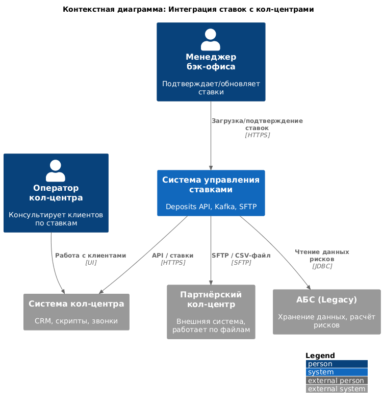
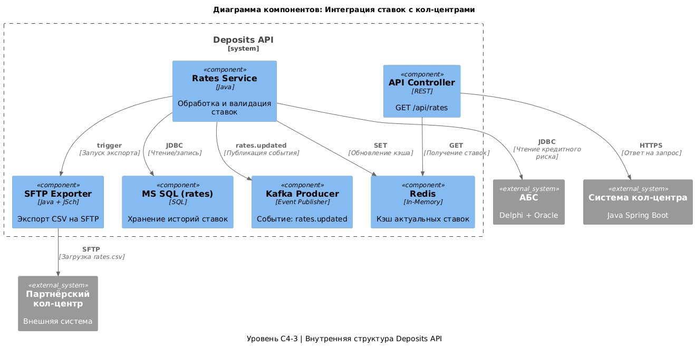

### **Название задачи:** 
### **Автор:** Хошафян Даниил
### **Дата:** 4 сентября 2025г
### **Функциональные требования**
Опишите здесь верхнеуровневые Use Cases. Их нужно оформить в виде таблицы с пошаговым описанием:
 - Клиент может подать заявку на депозит через сайт или интернет-банк.
 - Сайт отображает актуальные ставки.
 - Интернет-банк отображает персонализированные ставки.
 - Заявка обрабатывается сотрудником бэк-офиса (MVP).
 - Клиент получает СМС при подтверждении ставки и открытии депозита.
 - Система кол-центра уведомляется о заявке с сайта.
 - Данные передаются безопасно (HTTPS, шифрование).
  - Сотрудники внутреннего кол-центра должны видеть актуальные ставки по депозитам.
  - Сотрудники партнёрского кол-центра должны получать актуальные ставки ежедневно.
  - Ставки должны обновляться ежедневно на основе данных ЦБ и кредитного риска.
  - Данные для партнёра должны передаваться в виде файла (SFTP).
  - Внутренний кол-центр должен получать ставки через API.
  - Ставки должны быть доступны до открытия депозита (MVP).
  - Должна быть возможность ручного подтверждения ставок менеджером бэк-офиса.

| **№** | **Действующие лица или системы** | **Use Case**                            | **Описание**                                                                        |
|:-----:|:---------------------------------|:----------------------------------------|:------------------------------------------------------------------------------------|
|   1   | Менеджер бэк-офиса               | Обновление ставок в системе             | Загружает Excel-файл с новыми ставками или подтверждает автоматически рассчитанные. |
|   2   | Deposits API                     | Получение и валидация ставок            | Принимает ставки из АБС или Excel, сохраняет в БД.                                  |
|   3   | Deposits API → Redis             | Обновление кэша ставок                  | Кэширует актуальные ставки для быстрого доступа.                                    |
|   4   | Deposits API → Kafka             | Публикация события о новой ставке       | Уведомляет все системы о новых ставках.                                             |
|   5   | Система кол-центра               | Получение ставок через API              | Запрашивает ставки у Deposits API при работе с клиентом.                            |
|   6   | Deposits API → SFTP-сервер       | Экспорт файла ставок                    | Формирует CSV-файл и загружает его на SFTP для партнёрского кол-центра.             |
|   7   | Партнёрский кол-центр            | Получение файла ставок                  | Забирает файл с SFTP и загружает в свою систему.                                    |
|   8   | Сотрудник кол-центра             | Консультация клиента по ставкам         | Использует актуальные ставки для ответа клиенту.                               |

### **Нефункциональные требования**
Опишите здесь нефункциональные требования и архитектурно значимые требования.

| **№** | **Требование**                                                                                       |
|:-----:|:-----------------------------------------------------------------------------------------------------|
|   1   | Система должна поддерживать как автоматические, так и ручные обновления ставок — переходный период   |
|   2   | Система должна быть доступна 24/7 — особенно критична для кол-центра                                 |
|   3   | Передача данных партнёру — только через файл (SFTP), без API — ограничение партнёра.                 |
|   4   | Данные должны быть защищены при передаче (SFTP + шифрование) — соответствие требованиям безопасности |
|   5   | Отклик на запрос ставок — менее 500 мс — чтобы не задерживать работу операторов.                     |
|   6   | Решение должно быть совместимо с Java и MS SQL — экспертиза в банке                                  |
|   7   | Должна быть возможность аудита изменений ставок — для контроля и регуляторов                         |
|   8   | Интеграция не должна нагружать АБС — АБС уже перегружена                                             |
|   9   | Решение должно масштабироваться — при росте числа клиентов                                           |

### **Решение**
Приведите диаграммы контекста и контейнеров в модели C4. Опишите там основные компоненты и 
интеграции всех элементов решения.
\
\

**Альтернативные решения и их оценка**

Прямая передача ставок из АБС в кол-центр - АБС перегружен, нет экспертизы в интеграции с кол-центром.\
Email-рассылка файлов ставок - Ненадёжно, нет аудита, риск утечки.\
Ручная загрузка Excel в кол-центр - Высокий риск ошибок, не масштабируется.\
Реализация API для партнёра - Партнёр не поддерживает API, только SFTP.\
Хранение ставок только в Redis - Нет истории, сложно отлаживать.

**Недостатки, ограничения, риски**

| Риск                                    | Описание                                                   | Митигация риска                                                        |
|:----------------------------------------|:-----------------------------------------------------------|:-----------------------------------------------------------------------|
| Задержка в обновлении ставок у партнёра | Файл передаётся раз в день, возможна устаревшая информация | Уведомлять партнёра о сроках обновления                                |
|      Ошибка при экспорте файла (SFTP)   | Нет связи, файл не загружен.                               | Логирование, уведомления DevOps.                                       |
|Различие ставок между системами| Кол-центр видит неактуальные данные                        | Валидация на стороне Deposits API, TTL в Redis                         |
|Перегрузка Deposits API запросами на ставки| Много запросов одновременно                                |                    Кэширование в Redis, rate limiting                                                    |
|Утечка данных в файле| CSV содержит чувствительную информацию                     |        Шифрование файла (PGP), ограниченный доступ к SFTP                                                                |

